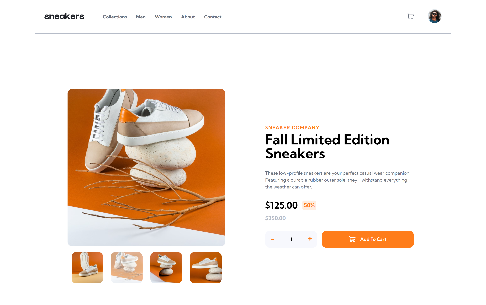

# Frontend Mentor - E-commerce product page solution

This is a solution to the [E-commerce product page challenge on Frontend Mentor](https://www.frontendmentor.io/challenges/ecommerce-product-page-UPsZ9MJp6). Frontend Mentor challenges help you improve your coding skills by building realistic projects.

## Table of contents

- [Overview](#overview)
  - [The challenge](#the-challenge)
  - [Screenshot](#screenshot)
  - [Links](#links)
- [My process](#my-process)
  - [Built with](#built-with)
  - [What I learned](#what-i-learned)
  - [Continued development](#continued-development)
- [Author](#author)
- [Acknowledgments](#acknowledgments)

**Note: Delete this note and update the table of contents based on what sections you keep.**

## Overview

### The challenge

Users should be able to:

- View the optimal layout for the site depending on their device's screen size
- See hover states for all interactive elements on the page
- Open a lightbox gallery by clicking on the large product image
- Switch the large product image by clicking on the small thumbnail images
- Add items to the cart
- View the cart and remove items from it

### Screenshot



### Links

- Solution URL: [GitHub repository!](https://github.com/maurocentu26/e-commerce-product-page)
- Live Site URL: [Add live site URL here](https://your-live-site-url.com)

## My process

### Built with

- Semantic HTML5 markup
- CSS custom properties
- Flexbox
- Mobile-first workflow

### What I learned
Approach the project using the BEM methodology for each HTML element. I still think I need more practice to see all the advantages of this methodology, but I am noticing relevant advantages over others.

As for CSS, beyond the use of flexbox, which I'm trying to improve, I discovered the "unset" property that is very useful when making responsive designs. Resetting the default property makes it much easier to style in a precise way.

Regarding the JavaScript code, this is the first project in which I use classes in different modules. I have to learn how to organize these classes better, but everything is achieved with practice. 
The advantages of using classes and modules are obvious, for that reason it is always better to approach the project this way.
There are two functions of which I would like to highlight their implementation. I am aware that it can be implemented, perhaps, in a better way, but I tried to be as practical as possible following the best practices for code.
Examples of the mentioned codes:
```js
showImage(image, imageContainer) {
        let clonedImage;

        imageContainer.querySelector(".actual__image").remove();

        clonedImage = image.cloneNode(true);

        clonedImage.className = "actual__image";

        imageContainer.appendChild(clonedImage);
    }
...
addProductsCart({products}) {
        const productsContainer = document.querySelector("#cart-products");

        this.cleanCart();

        if(products.length > 0) {
            document.querySelector(".cart__empty").classList.remove("active");
            document.querySelector("#checkout").classList.add("active");
        } else {
            document.querySelector(".cart__empty").classList.add("active");
            document.querySelector("#checkout").classList.remove("active");
        }

        products.forEach(product => {
            const {id, title, unitPrice, amount, totalPrice} = product;

            const item = document.createElement("DIV");

            item.className = "product__item flex";
            item.innerHTML = `
            <div class="item__thumbnail">
                    
                </div>
                <div class="item__info flex">
                    <span class="item__title">${title}</span>
                    <div class="item__price">
                    <span class="price__unit">${unitPrice}</span>
                    x 
                    <span class="item__amount">${amount}</span>
                    <span class="price__total">$${totalPrice}.00</span>
                    </div>
                </div>
            `

            const deleteProductBtn = document.createElement("BUTTON");
            deleteProductBtn.className = "product__delete";
            deleteProductBtn.innerHTML = `
                <svg width="14" height="16" xmlns="http://www.w3.org/2000/svg" xmlns:xlink="http://www.w3.org/1999/xlink"><defs><path d="M0 2.625V1.75C0 1.334.334 1 .75 1h3.5l.294-.584A.741.741 0 0 1 5.213 0h3.571a.75.75 0 0 1 .672.416L9.75 1h3.5c.416 0 .75.334.75.75v.875a.376.376 0 0 1-.375.375H.375A.376.376 0 0 1 0 2.625Zm13 1.75V14.5a1.5 1.5 0 0 1-1.5 1.5h-9A1.5 1.5 0 0 1 1 14.5V4.375C1 4.169 1.169 4 1.375 4h11.25c.206 0 .375.169.375.375ZM4.5 6.5c0-.275-.225-.5-.5-.5s-.5.225-.5.5v7c0 .275.225.5.5.5s.5-.225.5-.5v-7Zm3 0c0-.275-.225-.5-.5-.5s-.5.225-.5.5v7c0 .275.225.5.5.5s.5-.225.5-.5v-7Zm3 0c0-.275-.225-.5-.5-.5s-.5.225-.5.5v7c0 .275.225.5.5.5s.5-.225.5-.5v-7Z" id="a"/></defs><use fill="#C3CAD9" fill-rule="nonzero" xlink:href="#a"/></svg>`
            item.appendChild(deleteProductBtn);
            deleteProductBtn.onclick = () => deleteProduct(id);

            productsContainer.appendChild(item);
        });
    }
```
The first code corresponds to the implementation of displaying images. At first I thought of creating different methods for the lightbox and static gallery. Then I thought about making the "showImage" method of the UI class as reusable as possible, so I made an effort to have a single method for both.

The second code corresponds to the implementation for adding products to the shopping cart. I understood a bit more about how the DOM works and how I can create code snippets.

### Continued development

I must continue practicing with classes and modules, both in terms of their correct implementation and the abstraction of methods so that each class is as independent as possible. 
Regarding the layout, I still need to learn the correct handling of properties for a more compact and practical responsive design.

- Website - [Add your name here](https://github.com/maurocentu26)
- Frontend Mentor - [@yourusername](https://www.frontendmentor.io/profile/maurocentu26)

## Acknowledgments

To me :D